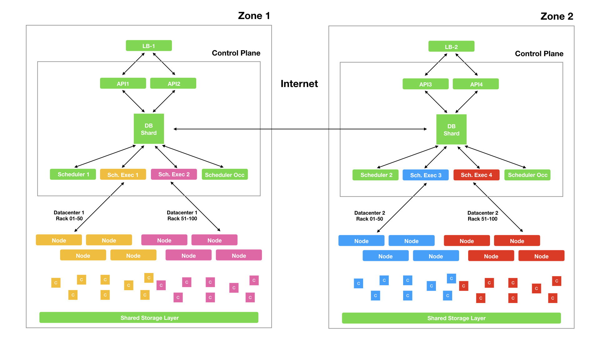

---

## System components

PWM is composed by different microservices.

For the Control Plane we have:

- API: receive request by users and read/write to the DB
- Scheduler: one scheduler per zone, no more no less. The scheduler will assign workloads on the nodes of the zone.
- Scheduler Executor: send commands to worker nodes. At least one is required, but you can replicate it in order to scale the HTTPS traffic.
- Scheduler OCC: check users credit usage. Not mandatory.
- Messenger: send messages about workloads status to users. Not mandatory.
- Metric Server: (In Progress) Collect and store usage metrics. Not mandatory. 

## Architecture

PWM can be a single cluster service, or can connect multiple cluster together.

 

More on arch will come soon.