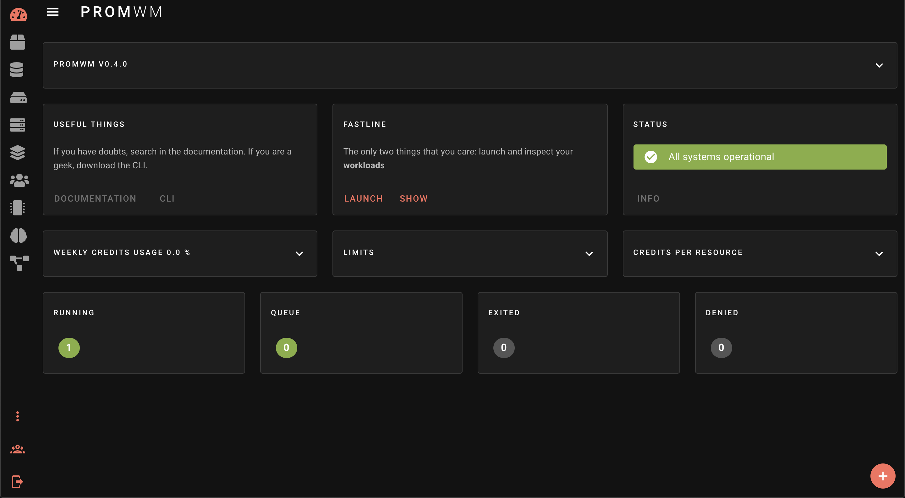
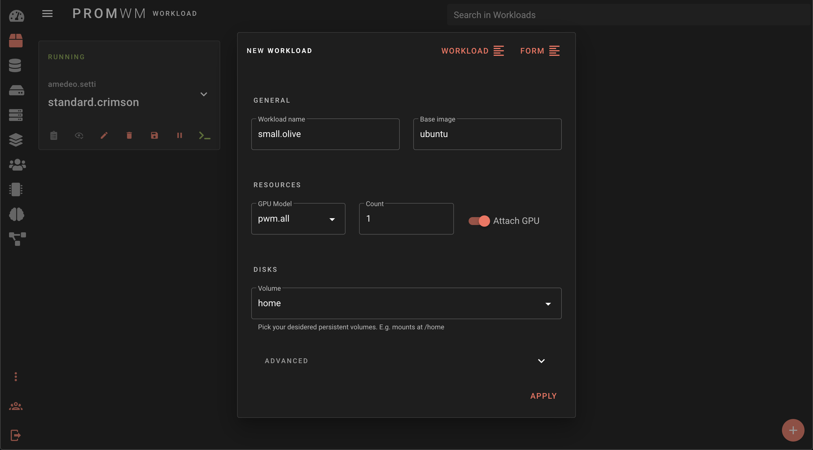

---

# Web Interface

## Accessing 

Open a browser and go to your api server.

Insert the same token you used for the CLI.

## Layout

Once signin, you will find a Progressive Web App, with a Navbar and a Sidebar.
The content in the sidebar dependes on your roles and permissions.

## Editor

On the bottom-right navbar section, you will find the NEW button.

If you click on the *NEW* button, an YAML/FORM editor will appear: you can paste the code you want and apply it,
like you do with the CLI.

Once you have applied a Workload, go to the next section.

## Workloads

Clicking on the Workload on sidebar, you will see your running or paused workloads. 
You can stop/delete/pause/resume/connect to each workload by click the corresponding action on the workload row.

