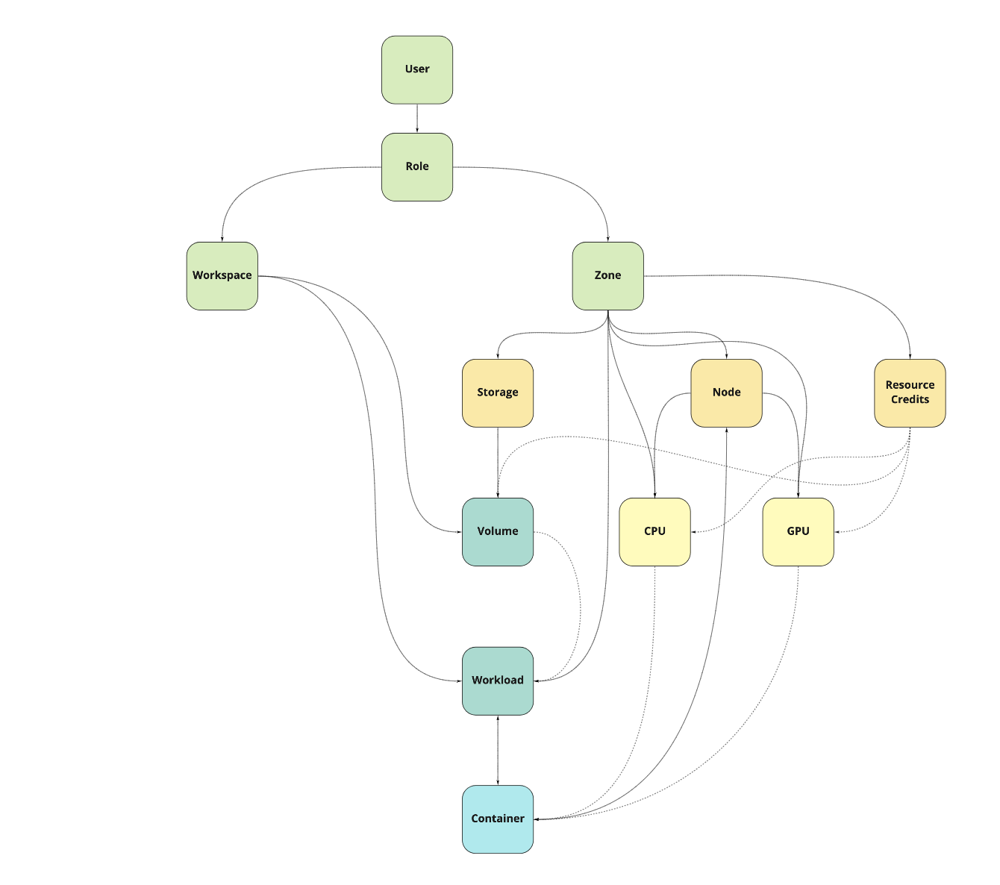

::: tip A note for Kubernetes users
If you ever used Kubernetes before, you will find a lot of similar
things when using Dora, like the CLI, the YAML files etc.

But apart from the *interface* similarities, Dora is a different
system, much more easier to develop and to maintain and oriented
to GPU clusters and AI workloads.

We have tried to provide a similar interface because we use
and **love** k8s, but we wanted also to build a system that can
be used with little effort by everyone. For instance, you will not find Pods, 
Deployments, Stateful set etc, but only Workloads. 

Also, the Dora network layer is of the most basic kind. 
When you will need *advanced* stuff like service discovery, 
vxlan, DNS and load balancing, you will use Dora to command
k8s pods. 
:::

::: warning A note for non Docker users
You can use this system without knowing Docker,
but a little knowledge on how containers works can help.
:::

## Resource division

Dora support the aggregation of multiple cluster (cluster
in differents *intranet*) to form one system, where you
can choose in which **zone** operate from the same interface.
This is a *physical* division. Nodes and storage
of a cluster usually are not reachable in another cluster.

There is also the **workspace** division, a logical
division that allow the separation of resources.  

So inside Dora there are three kind of resources:

- `resources` these objects lives in every zone, every workspace
- `zoned_resources` these objects are relative to one zone
- `zoned_workspaced_resources` these objects are relative to one workpace inside a zone


The following picture should help to understand this division:




### Resource kind

Starting from the previus division, we can now
list all the resource kind available in Dora.


| Kind      | Zoned | Workspaced |
|-----------|-------|------------|
| User      | no    | no         |
| Role      | no    | no         |
| Storage   | yes   | no         |
| Node      | yes   | no         |
| Credit    | yes   | no         |
| Workload  | yes   | yes        |
| Container | yes   | yes        |
| Volume    | yes   | yes        |


Every resource kind has is own YAML description, so in the following
part we will use these format to explain resources.


## Workloads	

Workloads are the main unit of Dora, the one the users need and use,
the one that is why we have built this system.

Workloads are the definition of what you want: to every workloads
can be associated one or more containers. 
Containers are build for you by the scheduler. The scheduler also
watch differences between the running container version and 
the current workload version, so if you change something under
the spec field in the workload, the scheduler will propagate these
changes to the containers.

A workload definition can be really simple or a little bit less simple:
we start from the simple one.
**All the fields in this example are mandatory.**


```yaml
apiVersion: v1     # A cluster can have multiple API version 
kind: Workload     # This is the resource kind
metadata:
  name: blue.red   # Unique name in the zone/workspace
spec:
  driver: Docker   # Specify to use Docker driver [more drivers are available]
  selectors:	   # Select what hardware the workload need s	
    cpu:			
      product_name: All # Everything that is uppercase means is a Dora constant
      count: 1
  image: 
    image: ubuntu	# Docker image to use
  config: 
    cmd: /bin/bash  # Command to run 
```

In this example you don't specify the zone and the workspace,
so the system will apply the default zone and your default workspace.
Also you don't have volumes and networks, and only one replica.


A more complete example is the following:


```yaml
---
apiVersion: v1
kind: Workload
metadata:
  zone: dc-rov-01 		# Zone
  group: amedeo.setti   # Workspace [Both group and workspace are valid keys]
  name: blue.red
spec:
  replica:
    count: 2			# We want two of this
  driver: Docker
  notify:
    byEmail: false		
  selectors:
    gpu:
      product_name:     # We want this kind of gpus
      	- Quadro RTX 6000  
      	- Tesla V100-SXM2-16GB
      count: 2
  image: 
    image: ubuntu
    pullPolicy: Always  # We want to pull always the image before running [default to IfNotPresent]
  config: 
	cmd: /bin/bash
	affinity: Distribute
	restartPolicy: Always # [default Never]
	shmSize: 1000000000   # Shared memory size in bytes 
  volumes:				  # We want these volumes
    - name: home
      target: /home
    - name: imagenetpytorch
      workspace: datasets
      group: datasets
      target: /imagenet      
  network:				  # We want the port 25000->8008 open for ingress
  	mode: bridge
  	ports: 
  		- name: first
  		  kind: NodePort
  		  protocol: tcp
  		  nodePort: 25000
  		  port: 8008
```

## Storage and volumes

Dora is heavily dependent on network storage, so the administrator should
setup NFS storages instead of rely on local nodes disks.

Every storage has an associated zone:

```yaml
---
apiVersion: v1
kind: Storage
metadata:
  zone: dc-rov-01
  name: dora.storage.01
spec:
  endpoint: 10.10.10.1
  mountpath: /dora-storage-01/share-01
  kind: NFS
```

Once an administrator has setup a storage, the user
can use a volume associated with that storage.


``` yaml{5}
---
apiVersion: v1
kind: Volume
metadata:
  zone: dc-rov-01
  group: amedeo.setti
  name: home
spec:
  storage: dora.storage.01
```

Volumes definition are translated into Docker named volumes and, thanks to the underlying
network storage, they can find and use their files on every node of the zone.


## Nodes

Nodes are where your container will run. On every node there is a **dora.node** service,
that will report to the API server the status of the node and get the things to do.

Nodes are defined in the following manner:

```yaml
---
apiVersion: v1
kind: Node
metadata:
  zone: dc-rov-01 	# Zone the node belongs
  name: emcprom09	
spec:
  schedulingDisabled: false # Default to false
  endpoint: https://10.10.10.2:3001
  allow: 
    - CPUWorkload	# Array of capability
    - GPUWorkload	
```


## Workspaces

Every user has at least one **workspace**, where it can run workloads, store data etc. 
You can clone your workspace to form another workspace, so you can organize your experiment
in more ordered way.

Workspaces definition is really simple:

```yaml
---
apiVersion: v1
kind: Workspace
metadata:
  name: amedeo.setti
```


## Zones

Every cluster has at least one zone. Zones are used to partition the resources,
in order to scale up with potentially thousands of compute servers and storages.
For every zone there is at least one API server and one scheduler.
The scheduler of a zone process the workloads only for the zone it has under control.


```yaml
---
apiVersion: v1
kind: Zone
metadata:
  name: dc-rov-01
spec:
  endpoint: https://mydora1.doracluster.com
```

## Roles and users

The administrator defines **roles**, like user role, admin role, and then
assign one or more of these roles to every user. 
One can be a normal user for all the resources in a zone/workspace,
but can also be an administor for the **storage** in zone.


Example of user role:

```yaml
---
apiVersion: v1
kind: Role
metadata:
  name: user
spec: 
  permission:
    Workload:
      - Apply
      - Delete
      - Get
      - Describe
      - Pause
      - Resume
      - Event
      - Version
    Container:
      - Apply
      - Delete
      - Get
      - Describe
      - Pause
      - Resume
      - Shell
      - Token
      - Log
      - Event
    Volume:
      - Get
      - Describe
      - Use
      - Upload
      - Download
      - Ls
      - Sync
    Project: 
      - Apply
      - Delete
      - Get
      - Describe
    Storage:
      - Get
      - Describe
    CPU: 
      - Get
    GPU: 
      - Get
    Resourcecredit: 
      - Get
      - Describe
    Usercredit: 
      - GetOne
      - Describe
    Workspace:
      - Clone     
    User: 
      - Credits 
```

An example of user:

```yaml
---
apiVersion: v1
kind: User
metadata:
  name: amedeo.setti
spec:
  default:
    workspace: amedeo.setti
    zone: dc-rov-01
  resources:
    - kind: All
      zone: All
      workspace: amedeo.setti
      role: user    
    - workspace: datasets
      zone: All
      role: user
      kind: Volume
  credits:
    - zone: dc-rov-01
      weekly: 500
    - zone: dc-test-01
      weekly: 100      
```

## Credits

Administrators can setup a credit system using the **dora.creditsys** service,
and they can setup the "price" for some resources, like GPU.

The same resource can have different price for different zone.

Once a user reach is max usage credits, the **dora.creditsys** service will
stop the user workloads. 

```yaml
--- 
apiVersion: v1
kind: Resourcecredit
metadata:
  zone: dc-rov-01	
  name: Tesla V100-SXM2-16GB
spec:
  product_name: Tesla V100-SXM2-16GB
  credit: 
    per:
      hour: 2.5
  annotations:
    priceUnit: €
```