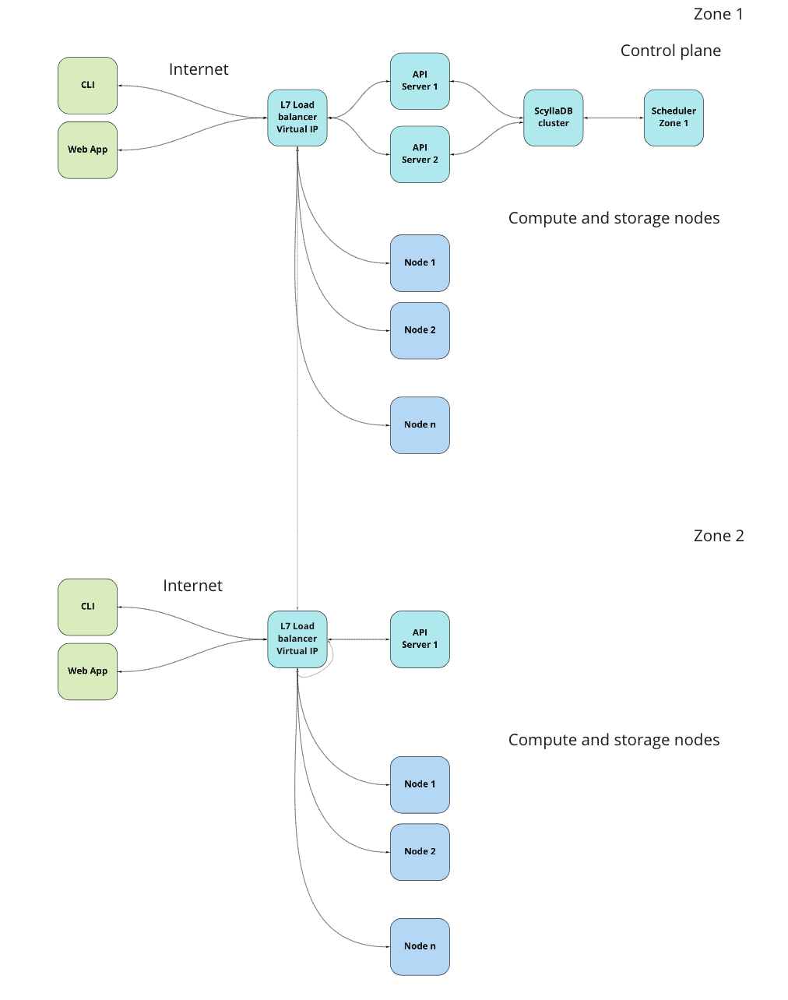
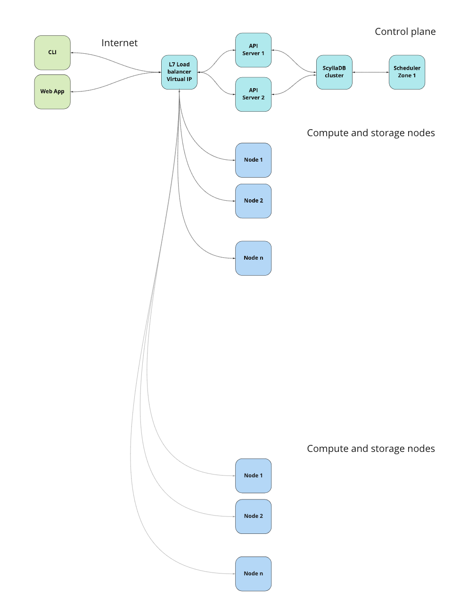

::: tip Dora
Dora is a distributed system that achieve scaling through resource partition.
It rely on ScyllaDB (the C++ version of Cassandra) partition and clustering key.
:::

### DB schema

Data is stored inside these tables:

- resources
- zoned_resources
- workspaced_resources   
- zoned_workspaced_resources    
- containers            
- events   
- versions                    
- actions    

``` js

const Action =
`\
CREATE TABLE actions (\ 
id UUID,\ 
zone text,\
resource_kind text,\
resource_pk text,\
action_type text,\
origin text,\
destination text,\
insdate text,\
owner text,\
PRIMARY KEY ((zone, resource_kind), destination, id)\
);\
`

const Version =
`\
CREATE TABLE versions (\ 
id UUID,\ 
resource_id UUID,\
zone text,\
resource_kind text,\
resource_pk text,\
origin text,\
destination text,\
resource text,\
insdate text,\
owner text,\
PRIMARY KEY ((zone, resource_kind), resource_id, id)\
);\
`

const Event =
`\
CREATE TABLE events (\ 
id UUID,\ 
resource_id UUID,\
zone text,\
resource_kind text,\
resource_pk text,\
origin text,\
destination text,\
resource text,\
insdate text,\
owner text,\
PRIMARY KEY ((zone, resource_kind), resource_id, id)\
);\
`


const Resource = 
`\
CREATE TABLE resources (\ 
id UUID,\ 
kind text,\ 
name text,\ 
meta text,\
desired text,\ 
observed text,\ 
computed text,\
resource text,\ 
resource_hash text,\
versions list<text>,\ 
insdate timestamp,\
owner text,\
PRIMARY KEY (kind, name)\
);\
`

const WorkspacedResource = 
`\
CREATE TABLE workspaced_resources (\ 
id UUID,\ 
kind text,\
workspace text,\  
name text,\ 
meta text,\
desired text,\ 
observed text,\ 
computed text,\
resource text,\ 
resource_hash text,\
versions list<text>,\
insdate timestamp,\
owner text,\
PRIMARY KEY ((kind, workspace), name)\
);\
`

const ZonedResource = 
`\
CREATE TABLE zoned_resources (\ 
id UUID,\ 
kind text,\
zone text,\  
name text,\
meta text,\ 
desired text,\ 
observed text,\ 
computed text,\
resource text,\ 
resource_hash text,\
versions list<text>,\ 
insdate timestamp,\
owner text,\
PRIMARY KEY ((kind, zone), name)\
);\
`

const ZonedWorkspacedResource = 
`\
CREATE TABLE zoned_workspaced_resources (\ 
id UUID,\ 
kind text,\
zone text,\
workspace text,\  
meta text,\  
name text,\ 
desired text,\ 
observed text,\ 
computed text,\
resource text,\ 
resource_hash text,\
versions list<text>,\
insdate timestamp,\
owner text,\
PRIMARY KEY ((kind, zone), workspace, name)\
);\
`

const Container = 
`\
CREATE TABLE containers (\ 
id UUID,\ 
kind text,\
zone text,\
workspace text,\  
meta text,\  
name text,\ 
workload_id UUID,\ 
node_id UUID,\ 
desired text,\ 
observed text,\ 
computed text,\
resource text,\ 
resource_hash text,\
versions list<text>,\
insdate timestamp,\
owner text,\
PRIMARY KEY ((kind, zone), workspace, name)\
);\
`

const ContainerToWorkload = 'CREATE INDEX workload_id ON containers(workload_id)'
const ContainerToNode = 'CREATE INDEX node_id ON containers(node_id)'     

```

## Components

Dora is composed by these components:

| Component      | Replicated   |
|----------------|--------------|
| dora.api       | yes          |
| dora.db        | yes          |
| dora.scheduler | one per zone |
| dora.creditsys | one per zone |
| dora.node      | one per node |

Clients and nodes communicate through the API service,
while scheduler and creditsys only see the DB cluster.

The API server can write on the **resource** and **desired** fields,
the scheduler on the **computed**, the nodes on the **observed** one.


## Security

### Bearer Token

Every API route is protected by a *Bearer Token*, that is inserted by the clients
in headers of the HTTP packet. Inside the Bearer Token there are encrypted the basic
info about the client, like the username, the workspace and so long.

The Bearer Token is the encrypted version of a *JSON Web Token*. 
Encryption key is choosen at the cluster creation by admins.

::: warning Encryption key
The encryption key should be very long and random.
:::

::: warning SSL required
To be secure, all the communications to the API server **must** be done through HTTPS,
using a valid certificate. 
:::

### Internal network

When the API server needs to proxy some request to the nodes, like during a Shell connection,
it communicate to the nodes using a self signed HTTPS certificate. So it's important
that you trust the internal network/s where your control plane and nodes lives.
The nodes can also use a valid certificate, via environment variables.

Proxied request:

- Shell
- Top
- Ls
- Sync
- Upload
- Download

### IP Filter and Rate Limiter

API server have an integrated IP Filter and Rate Limiter, you can customize the thresholds used by these to system via environment variables.
IP Filter add to the bad IP blacklist an IP when it fails for at least 3 times in a second a request to the API request. 


## Scaling up

There are multiple ways to scale up to multiple zones.
The most complete is the one showed in the following picture. In this solution 
every zone has the complete set of services, and the only thing you have to do is to
join the DB of each zone, maybe through a VPN.

<div style="text-align: center">
	
</div>

Another one is the following, where the *second* zone doesn't have the DB and the scheduler.
In that case, the second API server will only proxy request directed to nodes. 
The DB access and the scheduler for this zone are in the first zone (Not showed on the image).

<div style="text-align: center">
	
</div>

If your nodes have public IP or you don't my to connect to them,
you can also use they directly.

<div style="text-align: center">
	
</div>

