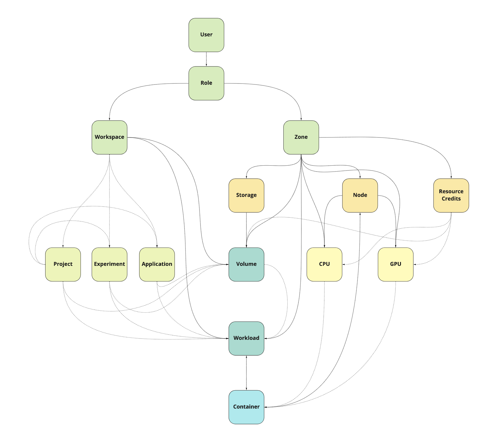

# Concepts

## Introduction

Dora is user centric, and tries to hide the complexity of the underlying network/hardware/storage structure
from the user. 

A beginner user should be able to start a new workload in seconds. By the way is important to know how Dora works
if you want to use it at 100%.   

## Resource kind

There are few types of resources kind, which you create/use/get/delete based on your role. See the following table:

| Kind           | Description                                     | Users should care? | Admins should care? |
|----------------|-------------------------------------------------|--------------------|---------------------|
| Workspace      | Base aggregation unit                           | Depends            | Yes                 |
| ResourceCredit | Credit definition for each resource type        | Yes                | Yes                 |
| Workload       | Base compute workload                           | Yes                | Yes                 |
| Container      | Compute container workload                      | Yes                | Yes                 |
| Volume         | Local/NFS attached Docker volume                | Yes                | Yes                 |
| Role           | Role permissions            					   | No                 | Yes                 |
| User           | User account, limits and permissions            | No                 | Yes                 |
| Zone           | Abstract resource division                      | No                 | Yes                 |
| Node           | Compute node, both GPU and CPU                  | No                 | Yes                 |
| Storage        | Local/NFS based storage                         | No                 | Yes                 |
| CPU            | Computed CPU resources                  		   | No                 | No                  |
| GPU            | Computed GPU resources                          | No                 | No                  |

## Resources relationships

 